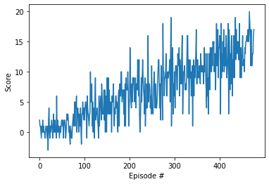
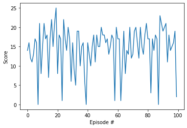

# Report

This is the detailed report on my implementation of the deep Q-learning algorithm for the Banana-Collector environment. I will just go through part 4 of the [Navigation.ipynb](Navigation.ipynb)-notebook because the learning algorithm is implemented there. Note that in part 4 I mostly adapted the code from the exercise in the Deep Q-networks lesson. Note also that the environment is already instantiated in part 1 of the notebook and referenced by the name "env".

Now to part 4:

First of all (in cell 11) the necessary packages are imported; most importantly torch and several subpackages of torch which will be used to build the neural network later.

In the next cell (with number 12) the QNetwork class is created in which the neural network, that will approximate the action value function Q, is set up. In lines 17-19 (in the \_\_init\_\_-function) one can see the architecture of the network. The input size is 37-dimensional which fits the size of the state vectors that will be the inputs for the network. Then we have two linear hidden layers of size 64 and one linear output layer of size 4 (which is the same as the number of possible actions). The idea here is that for each state input the four output values will estimate the action values of the four possible actions in that state.
In the forward-function the forward pass of the neural network is defined. One can see here (lines 25-27) that a relu-activation function is used for the two hidden layers whereas no activation function is applied to the output layer.

In cell 13 the Agent and ReplayBuffer classes are created. But first some of the hyperparameters are already fixed here, namely:

* BUFFER_SIZE = 100000    (number of stored experiences for the experience replay)
* BATCH_SIZE = 64         (batchsize of the batches that will be taken from the stored experiences during learning)
* GAMMA = 0.99            (discount rate)
* TAU = 0.001             (we will update the weights of the target network softly with factor TAU)
* LR = 0.0005             (learning rate)
* UPDATE_EVERY = 4        (the weights of the networks will only be updated every 4 steps)

Then it is checked if a GPU is available and the device is set to GPU if that's the case; otherwise we will continue with CPU.
In the Agent class (lines 10-110) there are 5 methods:
In the \_\_init\_\_-method two neural networks are instantiated (respectively will get instantiated when an instance of type Agent gets created); one that will be updated every 4 timesteps (that is the qnetwork\_local), one that will be updated all 4 steps - but only softly - and that will serve as an approximation to the target function (that is the network qnetwork\_target) and the optimizer for the backward propagation step is set to "Adam" (see lines 27-29). Furthermore the experience replay memory is initialized by creating a ReplayBuffer object (line 32).
In the step- and learn-methods the important parts of the learning step are implemented (see lines 36-46 and 68-97): By calling the step-method the experience replay memory is updated (line 38) and all four timesteps a batch from the memory is taken (line 45) and the learn-method gets called. By calling the learn-method in line 46 forward-and backward propagation of qnetwork\_local is carried out (see lines 80-93 for how the forward and backward propagation is implemented). Furthermore - by calling the soft\_update-method - the qnetwork\_target network gets updated softly with factor TAU. 
In the act-method the behaviour of the agent (depending on the current estimate of the action-value function) is defined. One can see that the agent acts epsilon-greedy while learning (see lines 63-66). To get the current estimate of the action-value function for the state the agent is in, the state vector first gets sent through qnetwork_local by doing a forward pass (line 59).
In the RepalyBuffer class (lines 113-151) it is defined how to add experiences to the experience replay memory (in the add-method; lines 132-135) and how randomly created batches are chosen from the memory (in the sample-method, lines 137-147).

In cell 14 the dqn()-function is defined. By calling this function later the deep Q-learning step will actually be carried out. The training loop (lines 14-38) does the following things in each episode (until either the training went on for n_episodes=1000 episodes or the goal of having an average score of +13 over 100 consecutive episodes is reached; see lines 35-38):
* The environment is reset (lines 15-16)
* the agent acts (line 19), gets an reward and a new state (lines 20-22) and learns by calling the step-method (line 24)
* The cumulative reward that was achieved in the episode gets stored in the scores-list and the scores_window-deque (lines 29-30)

The scores_window-deque is used to check if the goal was reached in the current episode (line 35) and the scores-list is used for a plot later.

